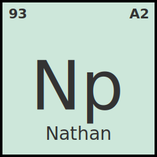

[](https://github.com/papes1ns/merln/actions/workflows/license-check.yml)
[](https://github.com/papes1ns/merln/actions/workflows/validate.yml)
[](https://github.com/papes1ns/merln/actions/workflows/deploy.yml)


<span style="font-weight: 800; font-size: 2rem; font-family:'IBM Plex Mono', monospace">merln</span>

**M**etadata-**E**nriched-**R**SS-**L**inker-**N**ode

## Overview

An example `merln` project.

- [x] typesafe code
- [x] schema validation
- [x] FOSS license audit
- [x] GDPR compliant
- [x] automation

`merln` is maintained by me. Originally started as a simple fork of an open source project by [SST](https://sst.dev). They are innovating across the board. Be sure to check them out!

## API

You can access this data through an API.

```bash
curl https://natepapes.com/api.json
```

### Validation

There's a GitHub Action that will automatically validate your submission against our schema to ensure:

- All required fields are present
- Data types are correct
- Values are within acceptable ranges
- TOML syntax is valid

### Schema Reference

Models must conform to the following schema, as defined in `packages/core/src/schemas.ts`.

**Provider Schema:**

```ts
export const Provider = z
  .object({
    id: z.string().toLowerCase(),
    name: z.string(),
    profile: z.string().url("Must be a valid URL"),
    rss: z.string().url("Must be a valid URL"),
    contents: z.record(Content).optional(),
  })
  .strict();
```

**Content Schema:**

```ts
export const Content = z
  .object({
    id: z.string().toLowerCase(),
    title: z.string(),
    description: z.string().optional(),
    url: z.string().url("Must be a valid URL"),
    created_at: z.string(),
    estimated_time_minutes: z.number().int().positive().optional(),
    tags: z.array(z.string()).optional(),
  })
  .strict();
```

### Examples

See existing providers in the `providers/` directory for reference:

- `providers/atomicobject/` - spin posts
- `providers/github/` - gist posts
- `providers/youtube/` - youtube posts

### Working on frontend

Make sure you have [Bun](https://bun.sh/) installed.

```bash
bun run dev
```

And it'll open the frontend at http://localhost:3000
